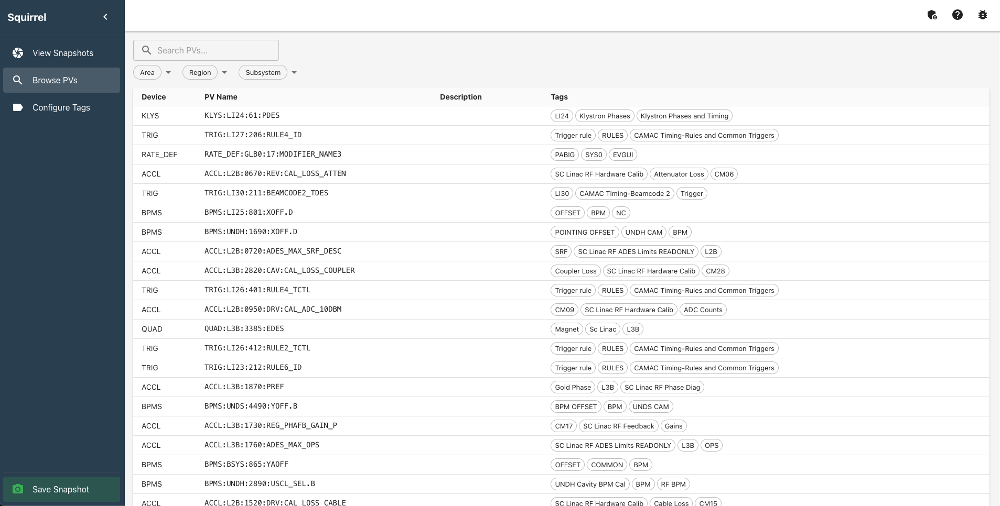

# Squirrel

Welcome to the Squirrel user guide. Squirrel application for configuration management of EPICS Process Variables (PVs).

## What is Squirrel?

Squirrel provides a responsive interface for:

- **Creating snapshots** of control system states
- **Comparing configurations** between different points in time
- **Restoring values** to return systems to known states

## Key Features

| Feature                   | Description                                                |
| ------------------------- | ---------------------------------------------------------- |
| **Snapshot Management**   | Create, view, and delete snapshots of PV values            |
| **Live PV Values**        | Real-time display of current values alongside saved values |
| **Snapshot Comparison**   | Side-by-side comparison with difference highlighting       |
| **Restore Functionality** | Preview and restore saved setpoint values                  |

## Getting Started

New to Squirrel? Start with the [Getting Started](getting-started.md) guide to learn the basics.

## User Guide

For detailed instructions on each feature, see the [User Guide](user-guide/index.md).
