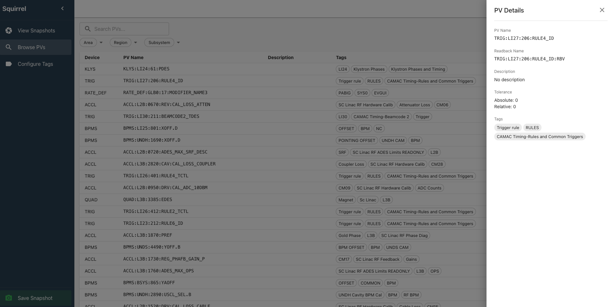
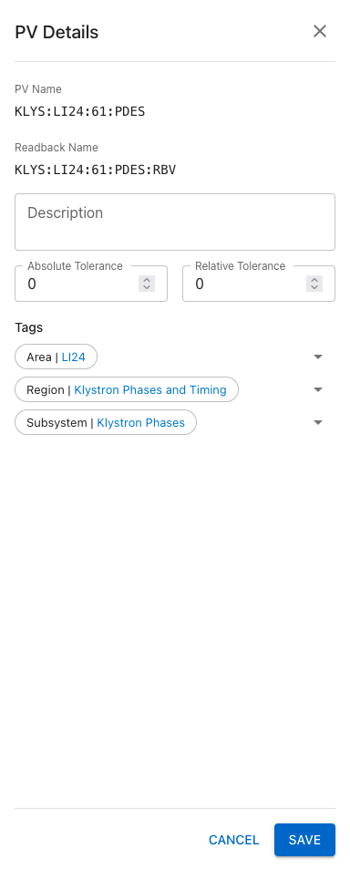

# PV Details

The PV Details page shows comprehensive information about a single Process Variable.

## Accessing PV Details

Click on any PV name in a table to open its details page.

## Information Displayed

### Basic Information

| Field           | Description                          |
| --------------- | ------------------------------------ |
| **PV Name**     | The full process variable name       |
| **Device**      | The device this PV belongs to        |
| **Description** | Human-readable description of the PV |

### Current Values

| Field            | Description                  |
| ---------------- | ---------------------------- |
| **Setpoint**     | The current setpoint value   |
| **Readback**     | The current readback value   |
| **Config Value** | The configured/nominal value |

Values update in real-time when connected to the control system.

### Assigned Tags

The details page shows all tag groups this PV belongs to. Tags help organize PVs for filtering in other views.

## Editing PV Information

!!! warning "Admin Required"
Editing PV information requires admin privileges.

With admin mode enabled:

1. Click the **Edit** button
2. Modify the fields as needed
3. Click **Save**

Editable fields include:

- Device
- Description
- Tag assignments

!!! note "PV Name"
The PV name itself cannot be changed after creation.

## Navigation

From the PV Details page, you can:

- Click **Back** to return to the previous view
- Use the sidebar to navigate to other sections
<!--  - Click on the device name to see other PVs in the same device (if supported) -->
